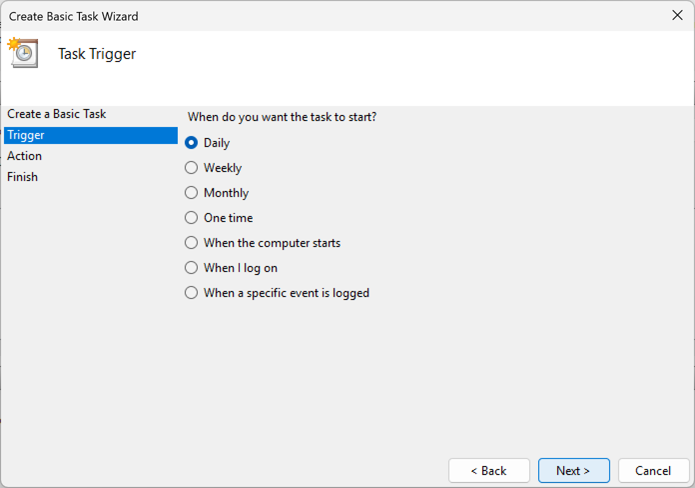

# Automating Windows Backups with Task Scheduler

The easiest way to set up a backup schedule has these steps:

1. Create a batch script to call Vintage Backup.
2. Create a VB script to call the batch script.
3. Call the VB script in Windows Task Scheduler.

One may want to skip making the VB script and put the batch script into Windows Scheduler.
However, the VB script can be configured to run in the background without opening a window.
One may also want to skip making the batch script and put the backup command line into the VB script.
A command line with options can be difficult to format correctly if quotation marks are needed.

All of the script files and the configuration file can be generated by running `py -3.13 vintagebackup.py <backup options> --generate-windows-scripts <destination>`.
This will create a configuration file (`config.txt`), a batch file (`batch_script.bat`), and a VB script file (`vb_script.vbs`) in the `<destination>` directory.
The configuration file will be generated in the same manner as described in [the wiki page](configuration_file.md#generating-a-configuration-file).
If files with those names already exist, the generated files will be renamed to prevent overwriting.
The command line options in `<backup options>` will be placed in the configuration file.

Scripts can be generated for other actions like [backup verification](verification.md) by including the relevant command line option (`--verify`, in this case).

In the example below, Alice will backup her home directory to an external backup drive every night at 2AM. She keeps the Vintage Backup script at `C:\Users\Alice\vintagebackup\vintagebackup.py` and a configuration file at `C:\Users\Alice\vintage_backup_config.txt`.

## 1. Batch file

In this example, this batch file is saved at `C:\Users\Alice\vintagebackup\home_backup.bat`.
This path will be copied into the VB script file in the next section.
The paths to the `vintagebackup.py` script and the configuration file need to be changed to their actual locations.
The full paths should be written out for both the Vintage Backup script and the configuration file.
Quotation marks are required if any of the paths have spaces in them.

```bat
py -3.13 "C:\Users\Alice\vintagebackup\vintagebackup.py" --config "C:\Users\Alice\vintage_backup_config.txt"
```
The call to `py -3.13` is used instead of `python` to make sure that the right Python version is used in case multiple versions are installed.
Using a configuration file is recommended to keep the script line short and to make it easy to change configurations in the future.

## 2. VB Script

In this example, the script is saved at `C:\Users\Alice\vintagebackup\home_backup.vbs`.
The only thing that needs customization in this file is the location of the `.bat` batch script.
The full path to the batch script should be written out.

```vb
Dim Shell
Set Shell = CreateObject("WScript.Shell")
Shell.Run """C:\Users\Alice\vintagebackup\home_backup.bat""", 0, true
Set Shell = Nothing
```

Don't forget the `, 0, true` at the end of the third line. The `0` prevents a terminal window from opening when the scheduled backup runs. The `true` causes the script to wait for the backup to finish before exiting, which will stop two instances of a backup process from being run at the same time in case one scheduled backup takes longer than expected to complete.

*The script was adapted from a [Server Fault (Stack Exchange) answer](https://serverfault.com/a/9039).*

## 3. Windows Task Scheduler

1. Start the Task Scheduler program by clicking on the start menu, typing "Task", and selecting the application.

2. Start a new task by selecting Create Basic Task from the Action menu.


3. Give a name and description to the task.
Click Next.


4. Choose how often to run the backup (daily is a good first choice).
Click Next.



5. Choose at what time of day to run the backup and what date to start (other choices may be shown on this page if daily wasn't chosen on the previous screen).
The time should be during intervals where the computer is not in use to avoid interfering with other activities--especially those that require a lot of use of the storage.
Click Next.


6. Choose "Start a program" for the action to be scheduled.
Click Next.


7. Specify the program to run.
The Program/Script box should have `C:\Windows\System32\wscript.exe`.
The Add arguments box should have the path to the VB script, `C:\Users\Alice\vintagebackup\home_backup.vbs` in this case.
Click Next.


8. Review the settings for the backup task to make sure they are correct.
Click Finish.


At this point, the backup has been scheduled and Task Scheduler can be closed. The backup task now appears in the list of other tasks and can be modified by double-clicking it, right-clicking and selecting Properties, or selecting it and choosing Properties from the Action menu.
